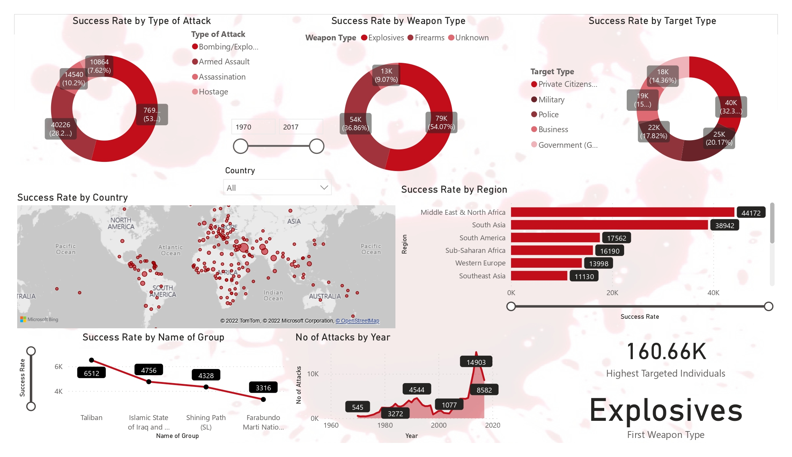
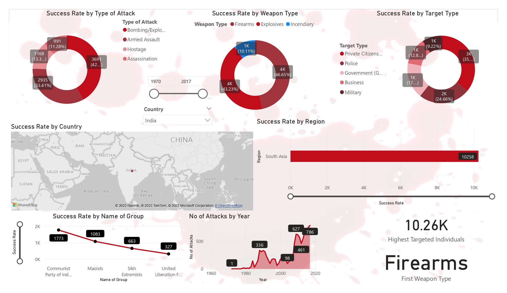
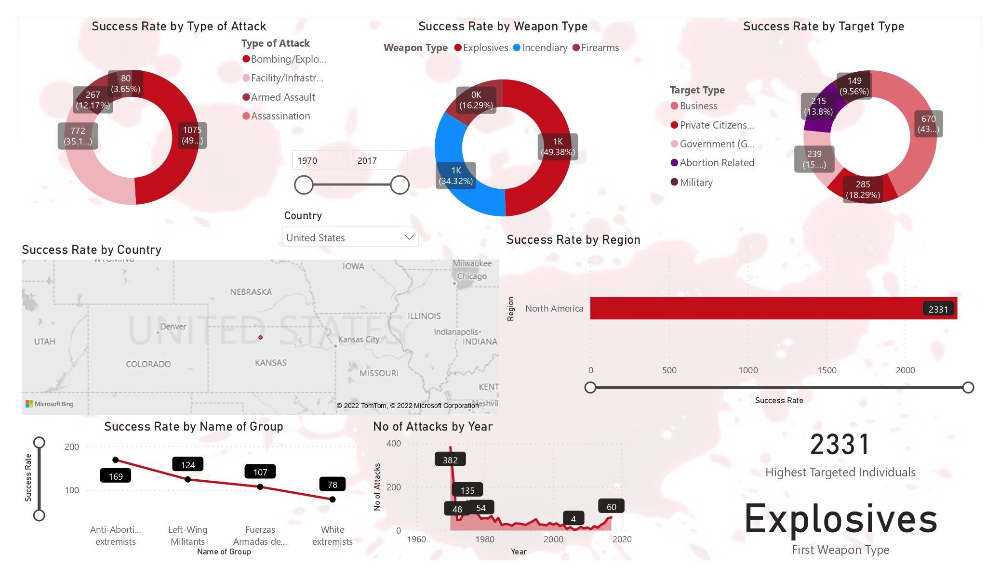

## Exploratory Data Analysis on Dataset Terrorism

Terrorist attacks have become a serious source of risk affecting the security of the international community. Using the `Global Terrorism Database (GTD)`, in order to quantitatively study past terrorist attacks and their temporal and spatial evolution the analytic hierarchy process (AHP) was used to classify the degree of damage from terrorist attacks. The various factors influencing terrorist attacks were extracted and represented in three dimensions.

 

## 👀 Screenshots

 

## 📓 Overview

-   Most of the attacks were attacked through explosives and then through firearms.
-   Attacks were more during 2014 and then in 2015. When compared to attacks from 1970 onwards, the last 6 years scored a maximum. But from 2014 onwards count started decreasing.
-   Almost Every day has the same contribution but attacks were low during 31st and high during 15th and 1st.
-   Iraq dominates all the countries and it has the highest number of attacks and then Pakistan, Afghanistan, and India follow it.
-   The Middle East& North Africa leads 1st among all the regions and then South Asia takes 2nd place.
-   For most of the attacks, the target is Private Citizens& property and the next Military leads.
-   Most of the attacks were through either Bombing or Explosion.

 

## 🔗 Links

    Scan this QR code for seeing the Power BI Project
    

## 🪪 License
This project follows the [MIT LICENSE](https://choosealicense.com/licenses/mit/).

 

<h3> Connect with me
</h3> 

     &nbsp&nbsp&nbsp
     &nbsp&nbsp&nbsp
     &nbsp&nbsp&nbsp
     &nbsp&nbsp&nbsp
    &nbsp&nbsp&nbsp

(<a href="#top">Back to top</a>)

 
